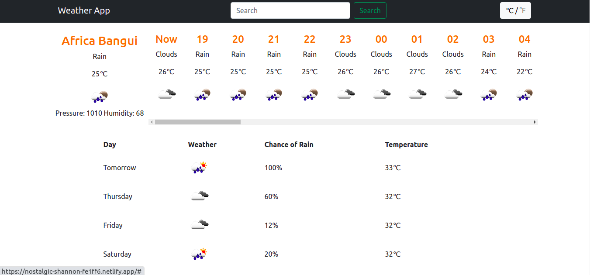

# Todo-list-Js
Microverse Javascript Curriculum
## About the app

This project is part of Microverse learning and the goal of this project was to demostrate learning and implementing the project by using uses async, await and fetch to get data from external api. This is project is a weather app where the user can check the weather of any city he likes. Also this app pulls from OpenWeatherMap API- and displays a lot more information about the weather than just the temperature.


## Live Demo

You can find the demo [here](https://nostalgic-shannon-fe1ff6.netlify.app)
## Screenshots



## Getting Started

## Setup

To get started, you should first get this file in your local machine by cloning or forking this project or typing in your terminal

> git clone https://github.com/Ceejayski/weather-app

> cd weather-app

> npm install webpack webpack-cli --save-dev

> npn install

Just run the command below for webpack to compile the code.

> npx webpack --watch

## Contributing

Contributions, issues and feature requests are welcome! Start by:

Forking the project

Cloning the project to your local machine

cd into the project directory

> cd Weather-app

> Run git checkout -b your-branch-name

Make your contributions

Push your branch up to your forked repository

Open a Pull Request with a detailed description to the development branch of the original project for a review

---

Built With

This project was built using these technologies.

```
Javascript

Webpack

HTML/CSS

Bootstrap

Axios

MomentJS

ESlint

VSCode editor

Git

Github
```

## 👨🏿‍💻 Creator

👤 **Author1**

- Github: [@ceejayski](https://github.com/ceejayski)
- LinkedIn: [LinkedIn](https://www.linkedin.com/in/okoli-ceejay/)
- Twitter: [Twitter](https://twitter.com/OkoliChijioke10)


## Contributions

Contributions, issues and requests are welcome

## Show support

Give a star if you like the project
